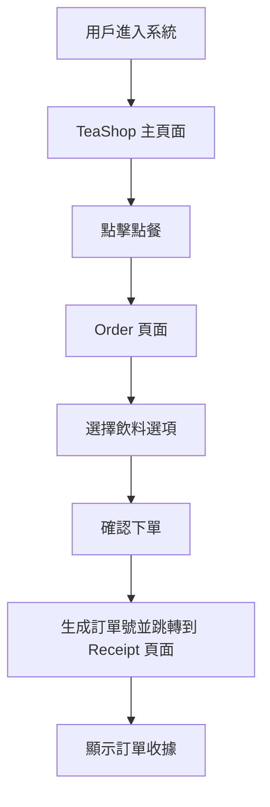

# Tea-Shop 點飲料系統說明文件

### 系統概述

Tea Shop 是一個基於 React 和 React Router 的飲料點餐系統，採用了現代化的前端技術架構，提供用戶友好的點餐體驗。

### 技術架構

#### 核心技術

- **React**: 主要前端框架
- **React Router**: 路由管理
- **TypeScript**: 型別安全
- **Bulma CSS**: UI 樣式框架

#### 組件結構

```
Tea Shop 系統
├── App (主應用程式)
└── Router (路由配置)
    └── TeaShop (主要業務邏輯)
        ├── Order (點餐頁面)
        └── Receipt (收據頁面)
```

### 文件結構說明

#### App.tsx

- **功能**: 應用程式入口點
- **職責**: 初始化 Bulma CSS 樣式並載入路由組件

#### Router.tsx

- **功能**: 路由配置與管理
- **路由結構**:
  ```
  / (根路徑)
  └── TeaShop 組件
      ├── /order (點餐頁面)
      └── /receipt/:orderNumber (收據頁面，支援動態參數)
  ```

### 頁面功能說明

#### TeaShop (主頁面)

- 作為整個飲料店的容器組件
- 包含系統的共用 UI 元素
- 透過 `<Outlet>` 切換顯示不同的子頁面

#### Order (點餐頁面)

- **路徑**: `/order`
- **功能**: 提供飲料選擇、客製化選項等點餐功能
- **用戶操作**: 選擇飲料、調整甜度冰塊、下單等

#### Receipt (收據頁面)

- **路徑**: `/receipt/:orderNumber`
- **功能**: 顯示訂單詳細資訊和收據
- **動態參數**: 支援不同訂單號碼的收據查看

### 系統流程



